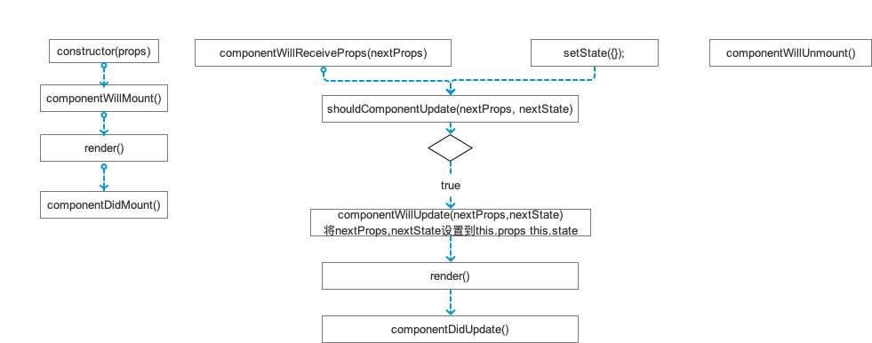

# 项目学习

***
# 原理
JS → JavaScript Core → Native代码

# 通信
组件之间的通信：props
跨组件通信：通知
RN与Native通信：参考官方文档

# ES6
* 箭头函数
* 解构赋值
* 延展操作符 ...
* 模板字符串 `name is ${name}`
* map 函数

# JSX
在js中嵌入xml

# 样式
* StyleSheet.create
* 多样式可传入数组，后面会覆盖前面的
* 可加入条件是否添加此样式

# 布局（flexbox）
flexDirection 主轴方向
> enum(‘row’, ‘column’,’row-reverse’,’column-reverse’)

flexWrap
> enum(‘wrap’, ‘nowrap’)，是否允许多行排列，不允许可能会溢出

justifyContent（主轴）
> enum(‘flex-start’, ‘flex-end’, ‘center’, ‘space-between’, ‘space-around’)

* space-between：第一个子组件位于父容器左端，最后一个子组件位于父容器最右端。然后平均分配在父容器水平方向上
* space-around：所有子组件平均分配在父容器的水平方向上，左右都有留空隙

alignItems（侧轴、交叉轴）
> enum(‘flex-start’, ‘flex-end’, ‘center’, ‘stretch’)

position
> enum(‘absolute’, ‘relative’)设置元素的定位方式

> absolute：生成绝对定位的元素，元素的位置通过 “left”, “top”, “right” 以及 “bottom” 属性进行规定。

> relative：生成相对定位的元素，相对于其正常位置进行定位。因此，”left:20” 会向元素的 LEFT 位置添加 20 像素。

# 组件生命周期

# 本地存储
AsyncStorage

# 网络
Fetch
Promise（处理异步）

# 一些命令
查询当前RN版本：react-native -version

查看8081端口使用情况：sudo lsof -i :8081

sudo kill -9 47276 （PID）

react-native info

react-native link

rm -rf node_modules && npm install

# 打包、上线
TODO

# 升级、适配
扫描、分享等Native组件供JS调用

升级参考：https://react-native-community.github.io/upgrade-helper/

# 打bundle包
react-native bundle --entry-file index.js --bundle-output ./ios/bundle/index.ios.jsbundle --platform ios --assets-dest ./ios/bundle --dev false

react-native bundle [参数]
构建 js 离线包 
Options:

-h, --help                   输出如何使用的信息

--entry-file <path>          RN入口文件的路径, 绝对路径或相对路径

--platform [string]          ios 或 andorid

--transformer [string]       Specify a custom transformer to be used

--dev [boolean]              如果为false, 警告会不显示并且打出的包的大小会变小

--prepack                    当通过时, 打包输出将使用Prepack格式化

--bridge-config [string]     使用Prepack的一个json格式的文件__fbBatchedBridgeConfig 例如: ./bridgeconfig.json

--bundle-output <string>     打包后的文件输出目录, 例: /tmp/groups.bundle

--bundle-encoding [string]   打离线包的格式 可参考链接https://nodejs.org/api/buffer.html#buffer_buffer.

--sourcemap-output [string]  生成Source Map，但0.14之后不再自动生成source map，需要手动指定这个参数。例: /tmp/groups.map

--assets-dest [string]       打包时图片资源的存储路径

--verbose                    显示打包过程

--reset-cache                移除缓存文件

--config [string]            命令行的配置文件路径